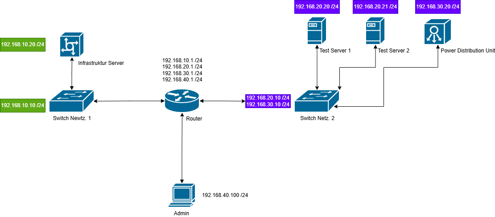

# Mise en place d'une infrastructure de teste
## Einleitung 

Dans le cadre du projet demandé, Je souhaite élaborer un projet technique à mettre en place sur mon lieu de travail. Dans une première phase, ce projet consiste à la mise en place d'une infrastructure de teste avec des appareils comme des serveurs et des Switchs.

## Le besoin 

Ce besoin vient du fait, qu'au sein de mon équipe, nous manquons de connaissances sur notre réseau car il est simplement pas accessible pour nous. Tout ce qui concerne nos équipements serveurs et réseau passent par le BIT. Or nous avons au sein de cette équipe des compétence informatique largement suffisante pour développer nos systèmes. Avec cette infrastructure de teste, nous pourrions mettre en place un système de Monitoring spécifique à nos besoins. C'est à dire Monitoré les services, les ports et les protocoles qui nous intéressent en fonction de nos besoins. 

Il faut aussi prendre en compte que le BIT est là pour mettre en place des solutions définitives, mais ils ne sont malheureusement pas tout le temps à notre disposition pour résoudre nos problèmes et cela peut parfois prendre énormément de temps. Tellement de temps que certains projets finissent par être abandonnés. Avec cette initiative, nous pourrions étudier nos systèmes dans une infrastructure sécurisé sans risqué de compromettre la sécurité de notre réseau de travail et ainsi développer des solutions que nous pourrons proposer au BIT. 

## Projektumfang 

Pour ce travail, je vais me concentrer de faire en sorte que la phase de mise en service soit testable et réalisable (reproductible). Cela veut dire développer une infrastructure réseau qui se rapproche de la réalité afin de mettre en place des prototypes de Monitoring et d'automatisations qui pourront être déployé sur l'exploitation. Afin de ne pas divulguer d'informations confidentielles et techniques sur la situation de notre exploitation, je parlerai uniquement de protocoles simples et courants afin d'illustrer mes propos. 

## Objectifs 

Pour rester simple, j'attribue 3 objectifs dans ce projet qui permettront d'évaluer mon idée : 

1. Définition de l'architecture réseau
2. Définition des éléments à surveiller
3. Prototypes d'automatisations de l'infrastructure

## Définition de l'infrastructure réseau 

Dans le schéma suivant, J'illustre l'infrastructure hardware minimale pour pouvoir effectué le Monitoring et les automatisations. Etant donné que nous n'avons pas accès aux règles Firewall, je n'en utiliserai pas dans ce prototype car il n'est pour l'instant pas relevant pour le Monitoring et l'automatisation de nos besoins. 



Nous distinguons 4 réseaux différents basés sur l'adresse privée 192.168.x.x / 24. 

### Netzwerk 1

Le réseau 192.168.10.0 /24 accueillera les solutions de Monitoring. Il peut communiquer avec le Netzwerk 2 par le router central ainsi qu'avec le ou les PC admin qui sont sur le réseau 192.168.40.0 /24. 

### Netzwerk 2 

Sur la même base que le réseau 1, il y a un Switch et deux serveurs de testes. Les serveurs de tests peuvent communiquer avec la passerelle ainsi que les PC admins. Cela est nécessaire pour l'automatisation ou l'envoi de logs au serveur Infra pour qu'il puisse faire ce qu'on va lui demander. Il y a également une PDU (Power Distribution Unit) qui n'est pas sur le même réseau que les deux serveurs de testes. Cela a été fait ainsi car dans notre exploitation, les deux types d'équipements ne sont pas sur le même réseau. Cette PDU a été intégrée au projet car il y a également des possibilités de Monitoring et d'automatisation pertinente. A noter que cela implique une configuration de port sur le Switch du réseau 2. LA PDU doit être atteignable uniquement depuis le réseau 1. 

### PC Admin 

Le PC admin a accès à tous les réseaux et tous les appareils qui s'y trouvent afin de pouvoir effectuer les configurations nécessaires. 

### Router 

Le Router intègre évidemment les 4 réseaux dont nous avons besoin. Je souhaite limiter au maximum les échange entre le réseau 1 et 2 afin de ne laisser passer que ce que je veux traiter. Il en va de même pour la PDU. Afin de définir ces règles, je souhaite configurer une machine Linux disposant de 3 ports LAN pour y connecter les Switch des réseaux 1 et 2 ainsi que le PC admin. De cette manière, les deux réseaux sont séparées physiquement. Linux übernimmt das Routing zwischen den Netzwerken. Die Zugriffsbeschränkungen werden mit nftables umgesetzt.

## Définition des éléments à surveiller 

Dans cette première phase, je souhaite Monitoré les serveurs de Teste ainsi que la PDU du réseau 2. Plus particulièrement, je souhaite Monitoré le trafic réseau entre le réseau 2 et le réseau 1. Le but de la première phase est de pouvoir analyser certains protocoles comme TCP afin de faire remonter d'éventuels erreurs. Ces erreurs doivent être analyser par le serveur Infrastructure se trouvant dans le réseau 1. 

Je souhaite également Monitoré le Switch du réseau 2. Car si il meurt, les serveurs ne pourront pas communiquer avec le serveur infra. Pour se faire, ce Monitoring se fera par le serveur Infra du réseau 1. Sur ce principe, il est également possible d'effectuer cette surveillance sur le réseau 1 mais je ne souhaite pas le mettre en place pour le prototype. Pour le prototype, je vie également avec le fait de ne pas avoir de surveillance du router avec un équipement externe. Etant donné que le PC admin y est directement connecté, je pourrai manuellement analyser des pannes ou des erreurs.

### Objectifs concrets 

| Bereich | Ziel | Kommunikation / Technik | Erwartetes Verhalten |
|---|---|---|---|
| Internes Monitoring | Kommunikation zwischen den Testgeräten überwachen | ICMP / TCP | Erlaubte Verbindungen müssen funktionieren |
| Testserver ↔ Testserver | Verbindung zwischen den Testservern prüfen | ICMP / definierte TCP-Ports | Verbindung erfolgreich |
| Testserver → Switch | Erreichbarkeit des Switches prüfen | ICMP, optional SNMP | Switch muss erreichbar sein |
| Testserver → PDU | Netzwerksegmentierung überprüfen | ICMP / TCP | Verbindung muss blockiert sein |
| Fehlererfassung | Kommunikationsfehler lokal protokollieren | Python-Skript / Logs | Nur Fehler und Abweichungen werden gespeichert |
| Log-Übertragung | Fehler einmal täglich an den Infrastrukturserver senden | TCP / definierter Log-Port | Nur vorhandene Fehler werden übertragen |
| Externes Monitoring | Testnetzwerk vom Infrastrukturserver überwachen | ICMP / TCP / SNMP | Testserver und Switch müssen erreichbar sein |
| SSH | Zugriff vom Infrastrukturserver auf die Testserver | TCP / 22 | SSH nur vom Infrastrukturserver erlaubt |
| Automatisierung | Testserver zentral konfigurieren | Ansible über SSH | Playbooks werden vom Infrastrukturserver ausgeführt |
| Standardregel | Nicht benötigte Kommunikation blockieren | nftables | Alles nicht explizit Erlaubte wird blockiert |

Voici les moyens permettant de tester ces objectifs : 

| Ziel | Wie wird es getestet? | Mittel / Werkzeuge | Erwartetes Ergebnis |
|---|---|---|---|
| Testserver ↔ Testserver | Von Testserver 1 die Verbindung zu Testserver 2 prüfen | `ping`, `nc`, Python-`socket` | Der Zielserver ist über die erlaubten Verbindungen erreichbar |
| Testserver → Switch | Regelmässig prüfen, ob der Switch erreichbar ist | `ping`, optional `snmpget` | Der Switch wird als erreichbar erkannt |
| Testserver → PDU gesperrt | Von einem Testserver absichtlich versuchen, die PDU zu erreichen | `ping`, `nc`, `curl` je nach Dienst | Die Verbindung wird blockiert |
| Interner Fehler erkannt | Testserver 2 ausschalten oder Netzwerkkabel trennen | Python-Monitoring-Skript | Testserver 1 erkennt den Fehler und erstellt einen Logeintrag |
| Switch-Ausfall erkannt | Switch im Testnetz ausschalten oder trennen | `ping`, Python-Skript | Geräte hinter dem Switch werden als nicht erreichbar erkannt und der Ausfall wird protokolliert |
| Nur Fehler protokollieren | Zuerst Normalbetrieb testen und danach absichtlich einen Fehler erzeugen | Python, Logdateien | Im Normalbetrieb wird kein Fehler gemeldet, nur Abweichungen werden gespeichert |
| Tägliche Logübertragung | Einen Fehler erzeugen und anschliessend die tägliche Übertragung ausführen | `systemd timer`, `cron`, Python | Die gesammelten Fehler werden einmal täglich an den Infrastrukturserver übertragen |
| Logempfang auf dem Infrastrukturserver | Nach einem bekannten Fehler die empfangenen Logs prüfen | Python, `journalctl`, Logdateien | Zeitpunkt, Gerät und Fehlertyp sind korrekt gespeichert |
| Infrastrukturserver → Testserver Monitoring | Einen Testserver ausschalten | `ping`, TCP-Prüfung, Python | Der Infrastrukturserver erkennt den Ausfall |
| Infrastrukturserver → Switch Monitoring | Den Switch ausschalten | ICMP, SNMP | Der Infrastrukturserver erkennt, dass der Switch nicht erreichbar ist |
| TCP-Dienst Monitoring | Einen überwachten Dienst auf einem Testserver stoppen | `nc`, Python-`socket`, `systemctl stop` | Der Infrastrukturserver erkennt, dass der Dienst bzw. Port nicht mehr erreichbar ist |
| SSH Infra → Testserver | Vom Infrastrukturserver eine SSH-Verbindung zum Testserver aufbauen | `ssh` | Die Verbindung ist erfolgreich |
| Nicht erlaubtes SSH | Von einem nicht autorisierten Gerät SSH zum Testserver versuchen | `ssh` | Die Verbindung wird durch `nftables` blockiert |
| Ansible-Automatisierung | Vom Infrastrukturserver ein einfaches Playbook ausführen | `ansible-playbook` | Die gewünschte Änderung wird automatisch auf dem Testserver durchgeführt |
| Ansible-Ergebnis prüfen | Das Resultat direkt auf dem Testserver kontrollieren | `cat`, `ls`, `systemctl` usw. | Der Zustand des Testservers entspricht der Definition im Playbook |
| Default-Deny mit nftables | Mehrere nicht vorgesehene Verbindungen testen | `ping`, `nc`, `ssh`, `curl` | Alle nicht explizit erlaubten Verbindungen werden blockiert |

Das Projekt gilt als erfolgreich, wenn folgende Bedingungen erfüllt sind:

- Nur die explizit erlaubten Kommunikationsverbindungen zwischen den verschiedenen Netzwerken funktionieren. Nicht erlaubte Verbindungen werden durch `nftables` blockiert.
- Das lokale Monitoring auf den Testservern funktioniert und erkennt Fehler bei den definierten Kommunikationswegen.
- Die Testserver übertragen einmal täglich die erkannten Fehler in Form von Logs an den Infrastrukturserver.
- Kleine Ansible-Automatisierungen können vom Infrastrukturserver aus erfolgreich auf den Testservern ausgeführt werden.

### Communications entre les équipements 

Afin d'illustrer les communications entre les équipements et les différents réseau, voici un exemple concret d'une nftables :

```nft
table inet filter {

    chain forward {
        type filter hook forward priority 0;
        policy drop;

        # Nur Antworten auf bereits erlaubte
        # Verbindungen zulassen
        ct state established,related accept


        # ==========================
        # INFRA -> TESTSERVERS
        # ==========================

        # SSH + Ansible
        ip saddr 192.168.10.20 \
           ip daddr 192.168.20.0/24 \
           tcp dport 22 accept

        # Ping für das Monitoring
        ip saddr 192.168.10.20 \
           ip daddr 192.168.20.0/24 \
           icmp type echo-request accept


        # ==========================
        # TESTSERVERS -> INFRA
        # ==========================

        # Senden von Logs / Fehlermeldungen
        ip saddr 192.168.20.0/24 \
           ip daddr 192.168.10.20 \
           tcp dport 5000 accept


        # ==========================
        # INFRA -> PDU
        # ==========================

        # Verfügbarkeitsprüfung
        ip saddr 192.168.10.20 \
           ip daddr 192.168.30.20 \
           icmp type echo-request accept

        # SNMP-Monitoring
        ip saddr 192.168.10.20 \
           ip daddr 192.168.30.20 \
           udp dport 161 accept


        # ==========================
        # ADMIN
        # ==========================

        # SSH vom Admin-PC
        ip saddr 192.168.40.100 \
           tcp dport 22 accept
    }
}
```

En résumé, seuls les flux utiles sont autorisés et les ports et protocoles sont spécifiés. Voici un tableau qui résume les possibilités actuelles : 

| Funktion | Protokoll / Port | Quelle | Ziel | Zweck |
|---|---|---|---|---|
| SSH / Ansible | TCP / 22 | Infrastrukturserver | Testserver | Administration und Automatisierung |
| ICMP | ICMP | Infrastrukturserver | Testserver / Switch / PDU | Verfügbarkeitsprüfung |
| SNMP | UDP / 161 | Infrastrukturserver | Switch / PDU | Monitoring von Netzwerkgeräten |
| Logs / Fehlermeldungen | TCP / 5000 | Testserver | Infrastrukturserver | Übertragung von Logs und Fehlern |
| Administration | TCP / 22 | Admin-PC | Netzwerkgeräte | Manuelle Konfiguration und Wartung |
| Standardregel | Alle | Alle | Alle | Standardmässig blockiert |

In einer ersten Implementierungsphase wird SSH für die Administration und Automatisierung eingesetzt. Weitere Protokolle wie ICMP, SNMP und ein definierter TCP-Port für die Logübertragung werden schrittweise für das Monitoring und Automatisierung ergänzt.


## Prototypes d'automatisations de l'infrastructure

Pour la première phase qui consiste à la surveillance réseau et l'envoi de logs, voici un exemple concret de Playbook pour l'envoi de logs au serveur Infra.


Ici, le script python qui doit tourner sur le serveur test : 

```python
import socket
from pathlib import Path

INFRA_SERVER = "192.168.10.20"
INFRA_PORT = 5000
LOG_FILE = "/var/log/test-monitor/errors.log"

log_path = Path(LOG_FILE)

if log_path.exists() and log_path.stat().st_size > 0:
    data = log_path.read_text()

    with socket.create_connection((INFRA_SERVER, INFRA_PORT), timeout=10) as sock:
        sock.sendall(data.encode("utf-8"))

    print("Logs envoyés avec succès.")
else:
    print("Aucune erreur à envoyer.")


```
Puis se fait déployer avec Ansible une fois par jour comme ceci : 

```yaml
- name: Deploy log sender
  hosts: testservers
  become: true

  tasks:

    - name: Copy Python log sender
      ansible.builtin.copy:
        src: send_logs.py
        dest: /usr/local/bin/send_logs.py
        mode: '0755'

    - name: Create monitoring log directory
      ansible.builtin.file:
        path: /var/log/test-monitor
        state: directory
        mode: '0755'

    - name: Create error log file
      ansible.builtin.file:
        path: /var/log/test-monitor/errors.log
        state: touch
        mode: '0644'
      
     - name: Send logs every day
      ansible.builtin.cron:
        name: "Send monitoring errors to infra server"
        minute: "0"
        hour: "23"
        job: "/usr/bin/python3 /usr/local/bin/send_logs.py"
```
Du côté du serveur infra, il faut un petit service qui écoute sur le port TCP 5000 : 

```python
import socket

HOST = "0.0.0.0"
PORT = 5000

with socket.socket(socket.AF_INET, socket.SOCK_STREAM) as server:
    server.bind((HOST, PORT))
    server.listen()

    print(f"Listening on TCP/{PORT}")

    while True:
        conn, addr = server.accept()

        with conn:
            data = conn.recv(65535)

            if data:
                with open("/var/log/testservers.log", "a") as log:
                    log.write(data.decode("utf-8"))
                    log.write("\n")
```

Ainsi nous pouvons créer un script et le déployer sur les machines de teste. Nous pouvons bien évidemment développer d'autres automatisations sur d'autres ports. 

Par exemple les logs des connexions réussies en ssh : 
```python
import subprocess
import socket
import re
from datetime import datetime

INFRA_SERVER = "192.168.10.20"
INFRA_PORT = 5001

# Ruft die erfolgreichen SSH-Verbindungen der letzten 24 Stunden ab
cmd = [
    "journalctl",
    "-u", "ssh",
    "--since", "24 hours ago",
    "--no-pager"
]

result = subprocess.run(
    cmd,
    capture_output=True,
    text=True
)

logs = result.stdout.splitlines()

pattern = re.compile(
    r"Accepted \S+ for (\S+) from ([0-9a-fA-F\.:]+) port (\d+)"
)

ssh_connections = []

for line in logs:
    match = pattern.search(line)

    if match:
        user = match.group(1)
        source_ip = match.group(2)
        source_port = match.group(3)

        ssh_connections.append(
            f"{line}\n"
            f"User: {user}\n"
            f"Source IP: {source_ip}\n"
            f"Source Port: {source_port}\n"
            f"-----------------------------"
        )

if not ssh_connections:
    print("Aucune connexion SSH trouvée.")
    exit()

message = "\n".join(ssh_connections)

with socket.create_connection(
    (INFRA_SERVER, INFRA_PORT),
    timeout=10
) as sock:

    sock.sendall(message.encode("utf-8"))

print("An den Infra-Server gesendete SSH-Verbindungen.")

```
Ici nous utilisons le port 5001. Il nous faudra donc écouter sur le serveur infra pour enregistrer les logs. 

### Evolutivité 

Dans les descriptions données jusqu'ici, je me suis concentré sur l'aspect réseau afin de maitriser cette infrastructure de teste. Le but final serait de créer des scripts de contrôle de tous les équipements. Par exemple des testes des appareils HF (Hautes fréquences) Comme les récepteurs. Nous surveillons le spectre, mais les appareils qui le permettent ne sont pas surveillés activement et c'est un gros défaut à mon sens. Au niveau software nous pourrions également tester les programmes dont nous avons besoin et automatiser certaines mises à jour par exemple. Nous aurions un gain de temps et l'erreur humaine de répétition ne serait plus un facteur. En revanche nous pourrions nous concentrer sur les vérifications. 


